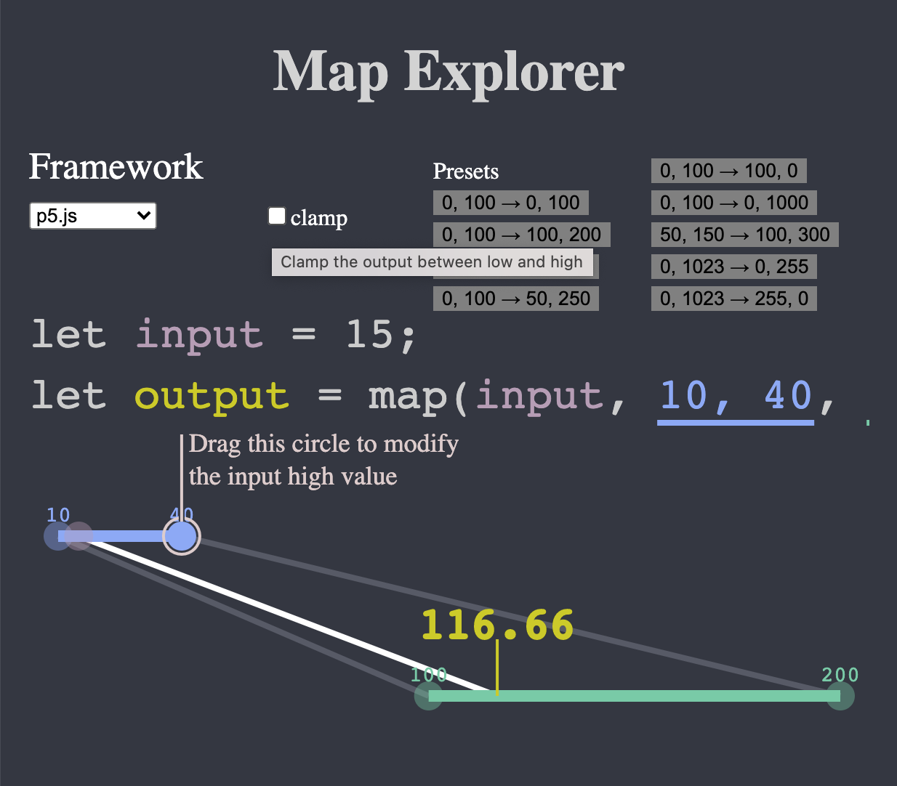

# `map` Explorer

An interactive visualization of the Arduino / Processing / p5.js `map` function.

## Instructions

Drag the circles to control the input value, and the input and output ranges.

## Related

Also see the [PWM Explorer](http://osteele.github.io/pwm-explorer/), for exploring Pulse Width Modulation.

## References

- [Arduino reference](https://www.arduino.cc/reference/en/language/functions/math/map/),
- [Processing reference](https://processing.org/reference/map_.html),
- [p5.js reference](https://p5js.org/reference/#/p5/map)

## License

MIT
